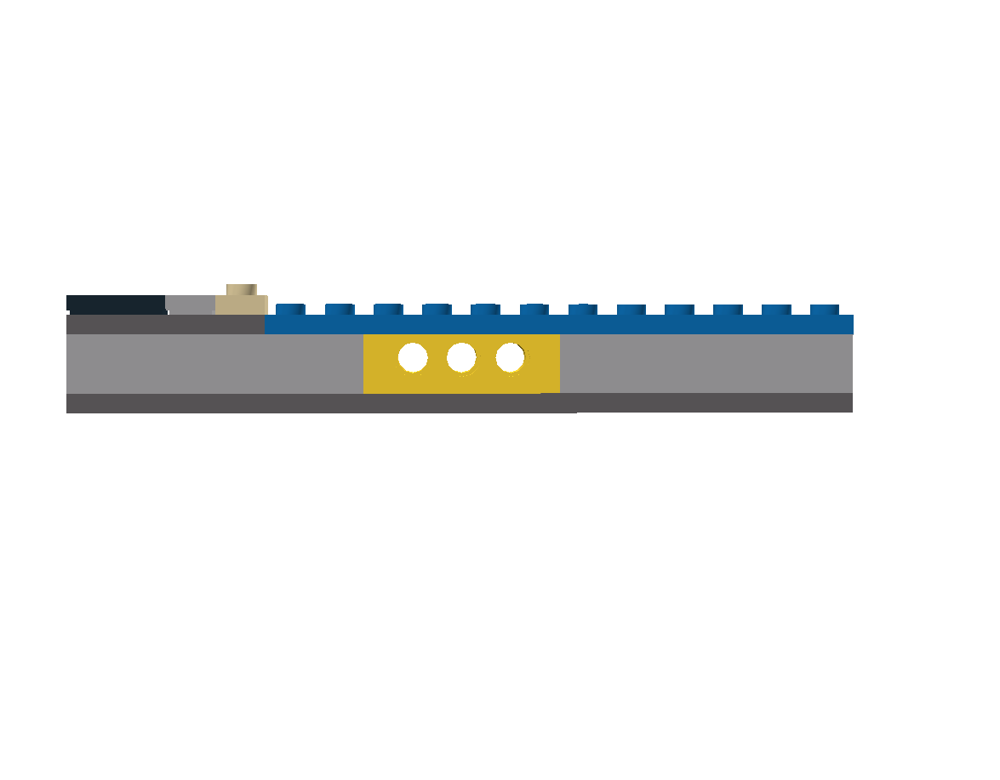
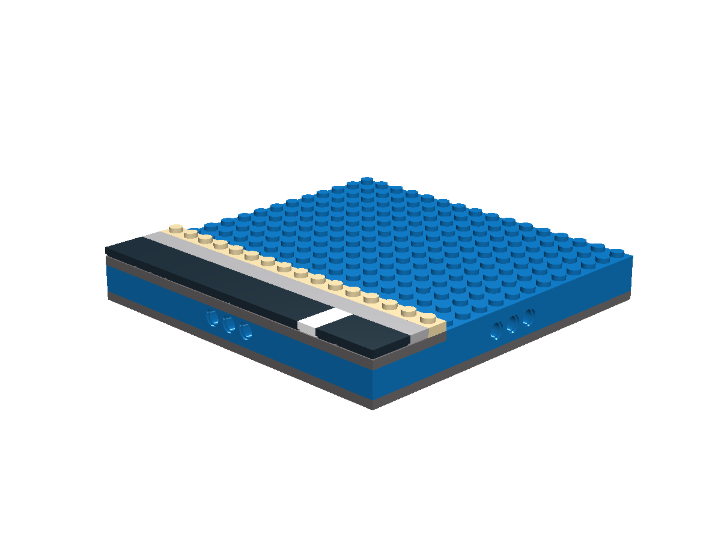
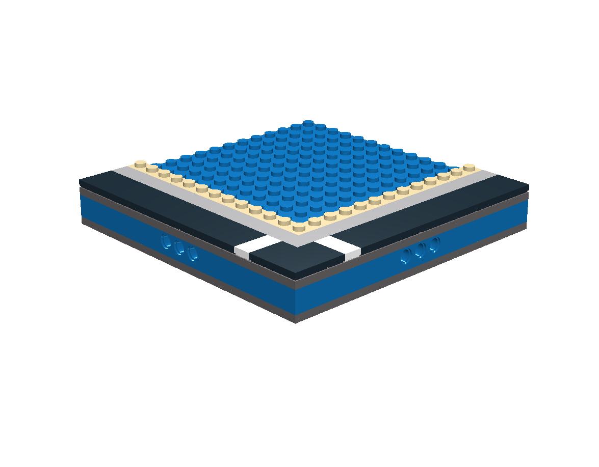
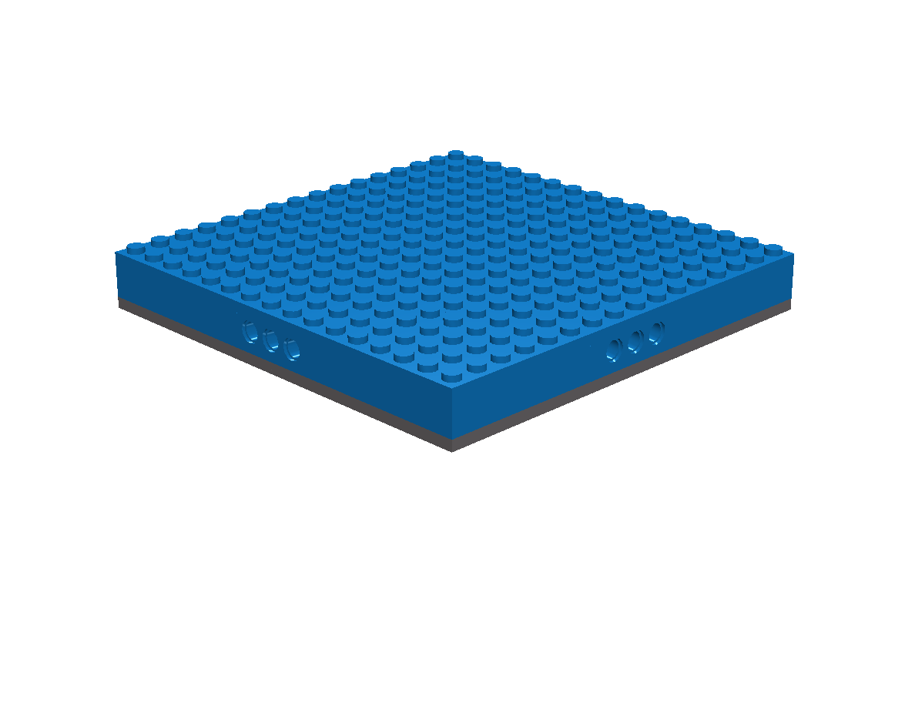
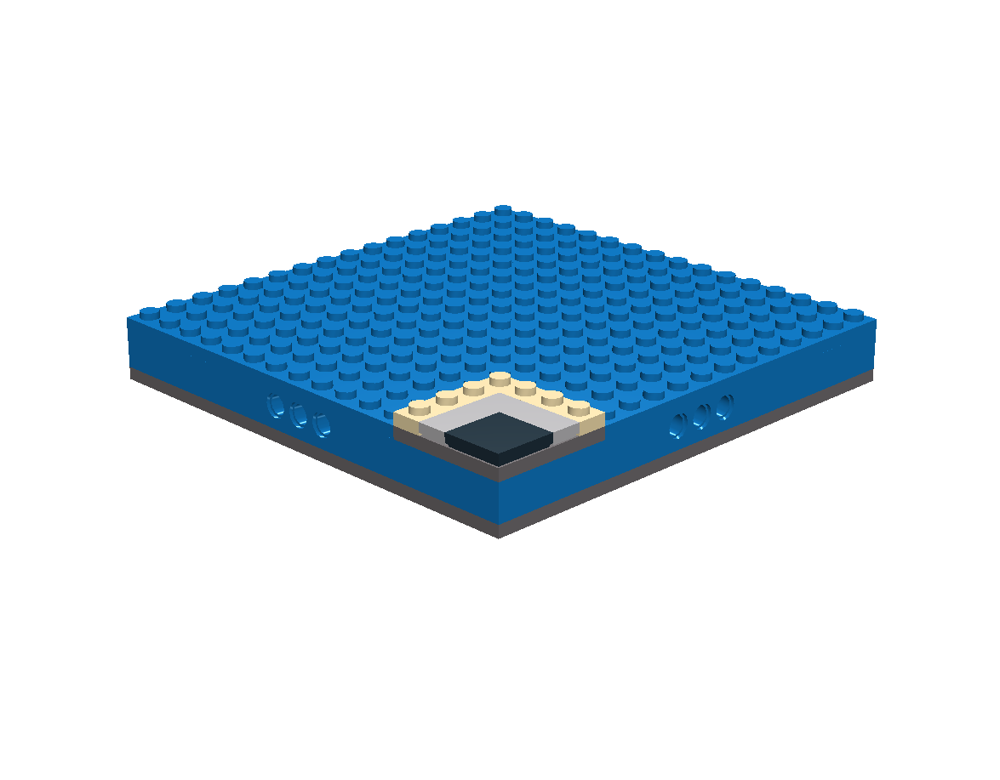
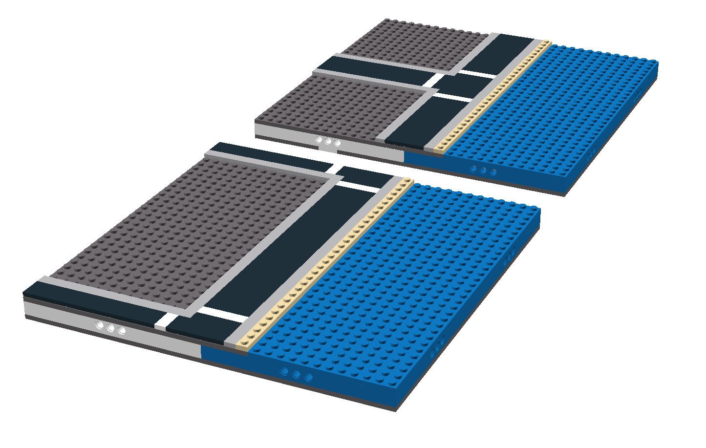
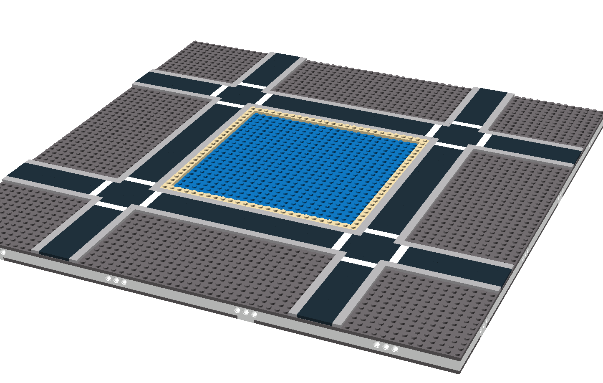
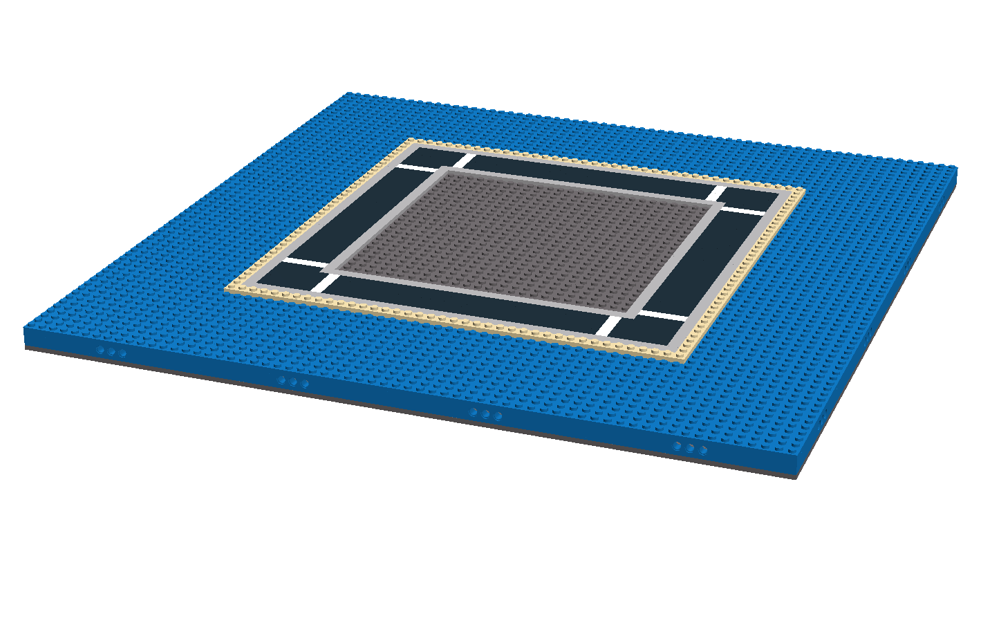
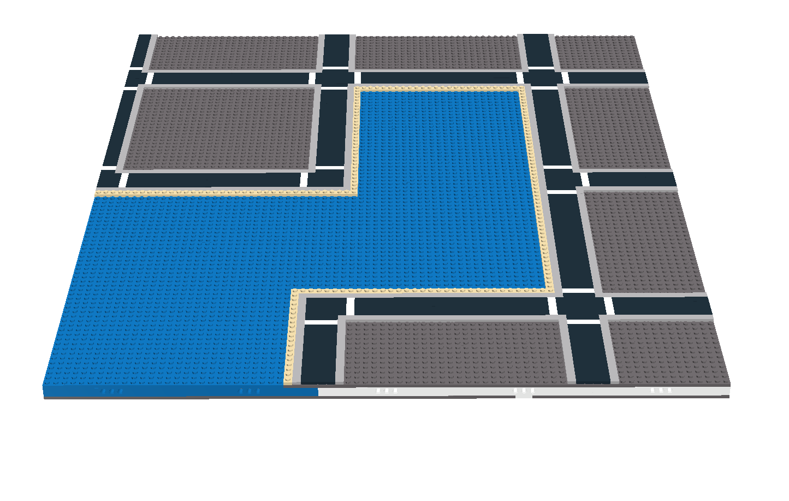

New in the v1.1 spec are Waterfront Modules. Last year at BrickWorld 2009 a few TwinLUG members debuted the initial concept of these modules for Micropolis with a lot of work in particular from Gary culminating in his amazing lighthouse module. The following proposed specification is based on his designs.

# Waterfront Modules

For all Waterfront modules the “water” is the top layer of plates in the module base sandwich immediately over the brick layer and must be Bright Blue in color. This puts the water level one plate below the level of the roads and sidewalks in the base modules. The outer stud at the water level must not be covered to allow for a consistent water level between Waterfront modules. For all Waterfront modules that border non Waterfront modules the first two studs along that side are standard road, the third stud is standard sidewalk and the fourth stud must have at least one plate in height in any appropriate color. This provides a consistent look from module to module along the waterfront.

In order to accommodate maximum flexibility while maintaining the consistent modular nature of existing Micropolis layouts, Waterfront Modules have four sub types: Edge, Open, Inner Corner, and Outer Corner.

## Edge Module

The Edge module is the simplest interface between the city and the water. It maintains standard roads and sidewalks along only one side. However the crosswalk may need to be moved to match the crosswalk position of the base module it is next to. Download the Waterfront Edge reference module in [Lego Digital Designer format](micropolis/examples/Micropolis-Waterfront_Edge.lxf).

## Inner Corner Module

The Inner Corner module borders Base modules on two contiguous sides and maintains the standard roads and sidewalks along those two sides. Download the Waterfront Inner Corner reference module in [Lego Digital Designer format](micropolis/examples/Micropolis-Waterfront_InnerCorner.lxf).

## Open Module

The Open module is the only Waterfront module that borders only other Waterfront modules. Because of this there are none of the usual roads and sidewalks along any sides. Download the Waterfront Open reference module in [Lego Digital Designer format](micropolis/examples/Micropolis-Waterfront_Open.lxf).

## Outer Corner Module

The Outer Corner module shares two contiguous sides with Waterfront Edge modules and two continuous sides with Waterfront Open modules. In many cases an Open module can be used as an Outer corner simply by adding the required road, sidewalk, and shore parts so plan ahead and have a few sets on hand when assembling a layout with lots of Waterfront. Download the Waterfront Outer Corner reference module in [Lego Digital Designer format](micropolis/examples/Micropolis-Waterfront_OuterCorner.lxf).

# Waterfront Examples

## Waterfront Example 1

This first examples show two basic uses of the Waterfront Edge modules. Both examples use two Base modules and two Waterfront Edge modules. The nearer example shows the Base modules combined in a half block and the other example shows the Base modules arranged with the Edge modules to form a T in the road. Note that in both examples the crosswalk in the Edge module has been moved to the appropriate location to line up with the crosswalks in the Base modules.

## Waterfront Example 2

This second examples shows the use of four Waterfront Inner Corner modules to form a “lake” in the middle of 12 Base modules. Technically this isn’t anything that could not have been accomplished previously since the four Inner Corner modules could just as easily be one base module that uses Blue plates. It is shown here instead to inspire some diversity in Micropolis layouts instead of always having a clean land and water division.

## Waterfront Example 3

Example 3 inverts the previous example and uses the Waterfront Edge and Outer Corner modules to form an island out of the surrounded Base modules. There are lots of possibilities for archipelago style layouts.

## Waterfront Example 4

Example 4 presents a larger and more complicated layout involving a small bay or harbor. Note that the Outer Corner modules are used to complete the existing road system while leaving most of the module free for building. Groups assembling large layouts that contain lots of Waterfront modules should think about keeping some spare Open modules on hand that can be used to fill in gaps.
